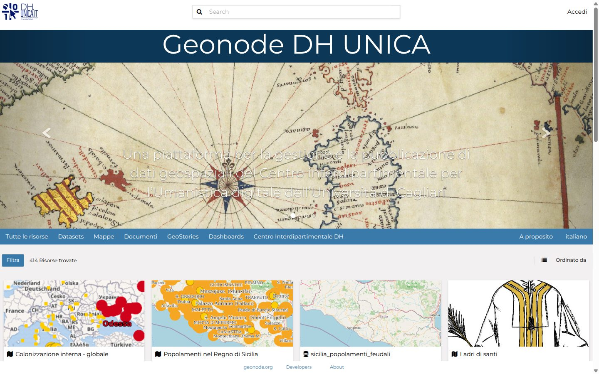
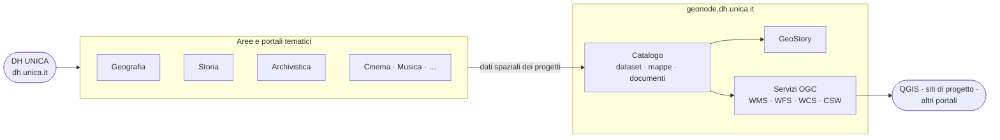
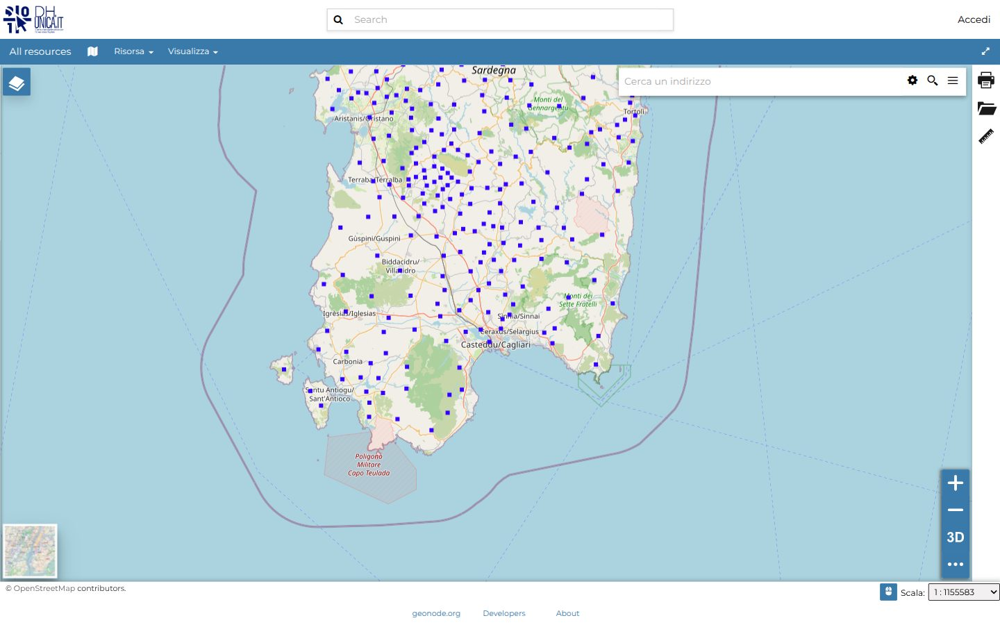
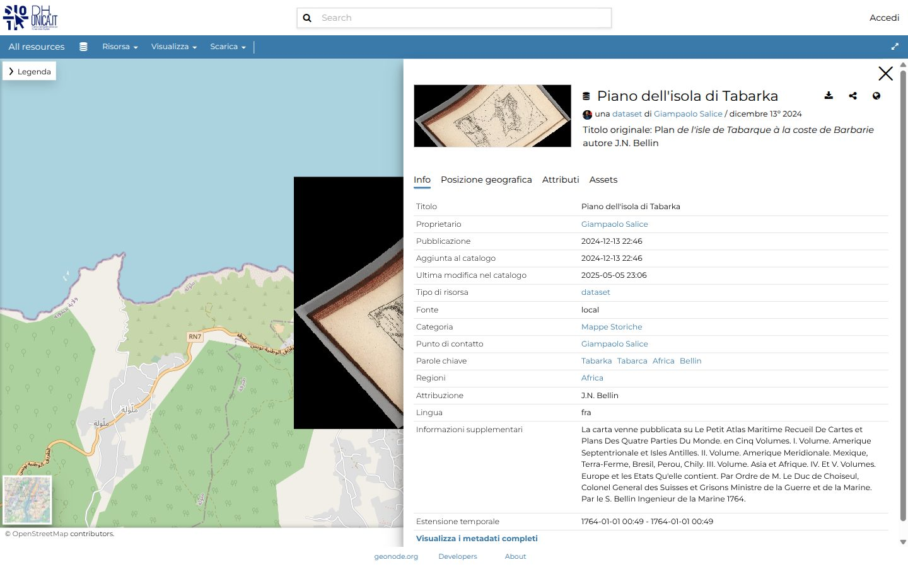
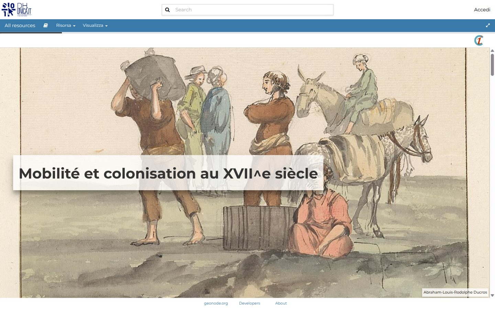
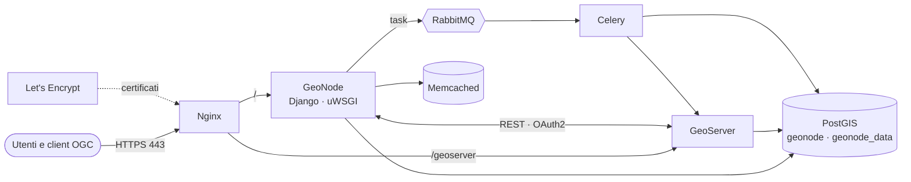

<div align="center">

# 🗺️ Geonode DH UNICA

**L'infrastruttura di dati geospaziali del Centro Interdipartimentale per l'Umanistica Digitale dell'Università di Cagliari**

[](https://geonode.dh.unica.it/)
[](https://geonode.org/)
[](https://geoserver.org/)
[](https://postgis.net/)
[](app/docker-compose.yml)
[](https://dh.unica.it/)



</div>

---

## Cos'è

**[geonode.dh.unica.it](https://geonode.dh.unica.it/)** è *"una piattaforma per la gestione e la pubblicazione di dati geospaziali del Centro interdipartimentale per l'Umanistica digitale dell'Università di Cagliari"*. Qui ricercatrici e ricercatori caricano, descrivono, combinano e pubblicano dati geografici: cartografia storica georeferenziata, confini amministrativi del passato, popolamenti e colonizzazioni, rotte e coste.

Si appoggia su [GeoNode](https://geonode.org/), una piattaforma open source per le infrastrutture di dati spaziali. Ogni risorsa ha metadati standard (ISO, Dublin Core, CSW), permessi per utente e gruppo, ed è disponibile come servizio OGC (WMS, WFS, WCS). Si può quindi riusare in QGIS, in altri portali e nei siti di progetto del Centro.

Questo repository contiene **la configurazione di produzione** della piattaforma (progetto `uni_cagliari`) e la documentazione per mantenerla e aggiornarla in sicurezza.

### I contenuti in numeri

<div align="center">

| 🗂️ Dataset | 🗺️ Mappe | 📄 Documenti | 📖 GeoStory | 🌐 Servizi remoti |
|:---:|:---:|:---:|:---:|:---:|
| **319** | **52** | **36** | **5** | **16** |

<sub>Inventario della produzione al 4 ottobre 2026: 290 layer e 409 stili in GeoServer, circa 33 GB di file caricati.</sub>

</div>

---

## Parte dell'ecosistema DH UNICA

[DH UNICA](https://dh.unica.it/) è il **Centro Interdipartimentale per l'Umanistica Digitale** dell'Università di Cagliari, nato su iniziativa del Dipartimento di Lettere, Lingue e Beni culturali. Il Centro sviluppa soluzioni tecnologiche per la ricerca umanistica, crea nuove fonti digitali transmediali, forma studenti e ricercatori e produce risorse aperte e riutilizzabili.

Le attività si organizzano in aree tematiche, ciascuna con il proprio portale: [Archivistica](https://archivistica.dh.unica.it/), [Cinema](https://cinema.dh.unica.it/), [Geografia](https://geografia.dh.unica.it/), [Musica](https://musica.dh.unica.it/) e [Storia](https://storia.dh.unica.it/). **Il GeoNode è l'infrastruttura geospaziale comune.** I progetti di ricerca vi depositano i dati con una componente spaziale, che diventano così mappe consultabili, servizi riusabili e racconti cartografici.



### Cosa ci si trova

<table>
<tr>
<td width="50%" valign="top">

**ASMSA: Atlante digitale per la Storia Marittima del Regno di Sardegna**
Mappa del progetto ASMSA, con i luoghi della storia marittima dell'isola su cartografia di base.



</td>
<td width="50%" valign="top">

**Cartografia storica georeferenziata**
Il *Plan de l'isle de Tabarque* di J.N. Bellin (1764), sovrapposto alla cartografia attuale e corredato di metadati completi.



</td>
</tr>
<tr>
<td width="50%" valign="top">

**GeoStory**
Racconti che intrecciano testo, immagini e mappe. Per esempio *Popolamenti e isole*, preparata per l'Atelier doctoral dell'École Française de Rome (2023).



</td>
<td width="50%" valign="top">

**Temi ricorrenti nel catalogo**
- 🏝️ *Mappe storiche* e portolani (categoria più ricca)
- 🧭 *Colonizzazioni* interne e popolamenti (Regno di Sicilia, Regno di Napoli, Sardegna)
- 🏛️ Feudi, confini e territori comunali storici
- ⚓ Torri costiere, porti e coste del Mediterraneo

Il catalogo completo si consulta su [geonode.dh.unica.it](https://geonode.dh.unica.it/).

</td>
</tr>
</table>

---

## 🧰 Stack tecnologico

| Componente | Immagine / versione | Ruolo |
|---|---|---|
| **GeoNode** (Django + uWSGI) | `uni_cagliari/geonode:4.4.1` | Catalogo, metadati, permessi, interfaccia MapStore, API REST v2 |
| **Celery** | stessa immagine di GeoNode | Attività asincrone: upload, thumbnail, sincronizzazione con GeoServer |
| **GeoServer** | `uni_cagliari/geoserver:2.24.4-v1` | Pubblicazione dei dati come servizi OGC, stili, cache delle tessere (GeoWebCache) |
| **PostgreSQL + PostGIS** | `uni_cagliari/postgis:15.3-latest` | DB `geonode` (catalogo) e `geonode_data` (dati vettoriali) |
| **RabbitMQ** | `rabbitmq:3-alpine` | Coda dei messaggi per Celery |
| **Memcached** | `memcached:alpine` | Cache applicativa |
| **Nginx** | `uni_cagliari/nginx:1.25.3-latest` | Reverse proxy HTTPS, file statici e media |
| **Let's Encrypt** | `uni_cagliari/letsencrypt:2.6.0-latest` | Emissione e rinnovo dei certificati TLS |

Personalizzazioni del progetto `uni_cagliari` rispetto al template [geonode-project](https://github.com/GeoNode/geonode-project):

- [`_geonode_config.html`](app/src/uni_cagliari/templates/geonode-mapstore-client/_geonode_config.html): configurazione del client MapStore;
- [`fixup_missing_maplayers.py`](app/src/uni_cagliari/management/commands/fixup_missing_maplayers.py): comando di manutenzione per i layer mancanti nelle mappe.

---

## 🏗️ Architettura



Nginx riceve tutto il traffico e lo smista tra GeoNode e GeoServer. GeoNode gestisce il catalogo e delega a GeoServer la pubblicazione dei dati; i due si autenticano a vicenda con OAuth2. Le operazioni lunghe passano a Celery tramite RabbitMQ.

I dati persistenti vivono in volumi Docker con prefisso `uni_cagliari-`: `dbdata` (database), `statics` (file caricati e asset), `gsdatadir` (configurazione e cache di GeoServer), `nginxcerts` e `nginxconfd`.

> [!NOTE]
> GeoNode gira su un **server dedicato** con un proprio Nginx e propri certificati, quindi **non** passa dal reverse proxy comune [`proxy.dh.unica`](https://github.com/caprowsky/proxy.dh.unica) che serve gli altri siti del Centro.

---

## 📁 Struttura del repository

```text
geonode.dh.unica.it/
├── README.md                 ← questo file
├── PIANO-AGGIORNAMENTO.md    ← piano di aggiornamento 4.4.1 → 4.4.5 → 5.x, con garanzie su dati e rollback
├── app/                      ← progetto GeoNode "uni_cagliari", copia esatta della produzione
│   ├── docker-compose.yml    ← definizione dei servizi
│   ├── Dockerfile            ← immagine GeoNode del progetto
│   ├── .env.sample           ← configurazione di produzione con i segreti oscurati
│   ├── docker/               ← Dockerfile di nginx, geoserver, postgis, letsencrypt
│   └── src/                  ← codice Django del progetto (settings, template, comandi, entrypoint)
└── docs/img/                 ← immagini di questo README
```

Gli script operativi (inventario, backup, restore locale, rollback) e l'override per la copia locale arrivano con il branch dell'aggiornamento, `feat/upgrade-geonode-4.4.5`.

---

## ⚙️ Configurazione

La configurazione sta in `app/.env`, che **non è versionato**. [`app/.env.sample`](app/.env.sample) ne è la copia fedele, con password, chiavi e token sostituiti da `<REDACTED>`.

| Variabile | Valore in produzione | Nota |
|---|---|---|
| `COMPOSE_PROJECT_NAME` | `uni_cagliari` | prefisso di container (`django4uni_cagliari`, …) e volumi |
| `GEONODE_BASE_IMAGE_VERSION` | `4.4.1` | tag dell'immagine GeoNode in uso |
| `SITEURL` | `https://geonode.dh.unica.it/` | URL pubblico |
| `GEOSERVER_LOCATION` | `http://geoserver:8080/geoserver/` | GeoServer visto dalla rete interna |
| `LETSENCRYPT_MODE` | `production` | certificati reali |
| `FORCE_REINIT` | `false` | ⚠️ **non va mai messo a `true`**: ricaricherebbe i dati iniziali, resettando admin e OAuth |
| `MONITORING_ENABLED` | `False` | monitoring di GeoNode disattivato |

---

## 🚀 Gestione in produzione

Il progetto gira in `/opt/projects/geonode441/uni-cagliari-geonode` sul server dedicato, con `docker-compose` v1.

```bash
cd /opt/projects/geonode441/uni-cagliari-geonode
docker-compose ps                      # stato dei servizi
docker-compose logs -f --tail=100 django
docker exec -it django4uni_cagliari python manage.py <comando>
```

> [!WARNING]
> Comandi da **non** usare mai, perché cancellano dati o l'immagine di rollback: `docker-compose down -v`, `docker volume rm/prune`, `docker system prune`, `./docker-purge.sh`, `docker rmi` sulle immagini `uni_cagliari/*`. L'elenco completo e le motivazioni sono nel [§5.2 del piano](PIANO-AGGIORNAMENTO.md#52-comandi-e-azioni-vietati-durante-tutta-lattività).

### Aggiornamenti

Gli aggiornamenti seguono [PIANO-AGGIORNAMENTO.md](PIANO-AGGIORNAMENTO.md):

1. **Fase A**: 4.4.1 → 4.4.5. Risolve l'errore 502 nel salvataggio degli stili CSS ([GeoNode #12716](https://github.com/GeoNode/geonode/issues/12716)) cambiando il minimo indispensabile.
2. **Fase B**: 4.4.5 → 5.0 → 5.1, da pianificare.

Ogni passo si prova prima su una copia locale isolata della produzione, con backup verificati e rollback provato.

---

## 🤝 Come contribuire

- **Mai commit diretti su `main`**: `main` rispecchia ciò che gira in produzione.
- Un branch per attività, creato da `main` aggiornato, con prefisso convenzionale: `feat/`, `fix/`, `docs/`, `chore/`, `refactor/`.
- Messaggi di commit **in italiano** con tipo convenzionale, per esempio `docs: aggiunge il README del progetto`.
- Ogni branch si chiude con una Pull Request; dopo il merge il branch si cancella.
- I rilasci in produzione hanno un tag: `prod-4.4.1` è lo stato di partenza.
- Prima di ogni push, controllare che non entrino segreti (`.env`, password, chiavi). Il [`.gitignore`](.gitignore) esclude già `.env*`, dump e backup.

---

<div align="center">
<sub>
<a href="https://dh.unica.it/">DH UNICA</a>, Centro Interdipartimentale per l'Umanistica Digitale · Università degli Studi di Cagliari<br/>
Basato su <a href="https://geonode.org/">GeoNode</a>, software open source della Open Source Geospatial Foundation
</sub>
</div>
